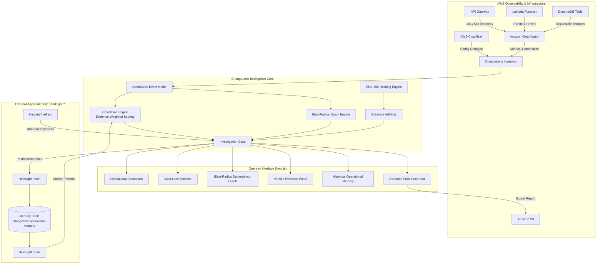
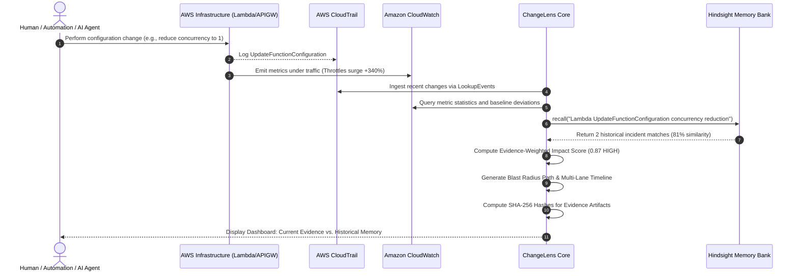
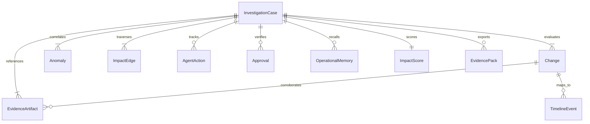
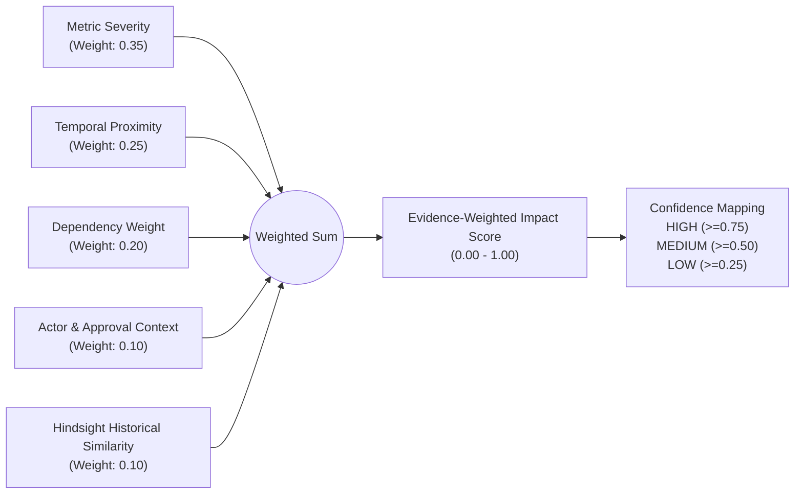

# ChangeLens Architecture Specification

**Project:** ChangeLens  
**Tagline:** AWS Change Impact & Operational Memory  
**Edition:** AWS Builder Center — Zero to Shipped (October 2026)  

---

## 1. System Overview

ChangeLens is an evidence-driven operational intelligence layer above AWS observability. It does **not** attempt to replace CloudWatch, CloudWatch Omni, CloudWatch Investigations, Application Signals, AWS Config, CloudTrail, or AWS DevOps Agent. AWS remains the definitive source of telemetry, infrastructure state, and change evidence.

ChangeLens connects:
```
AWS Changes ──► Actors ──► Resources ──► Dependencies ──► Telemetry Anomalies ──► Agent Actions ──► Approvals ──► Blast Radius ──► Evidence Artifacts ──► Operational Memory
```

The core question ChangeLens answers is:
> **"What changed, what did it likely affect, what evidence supports that conclusion, and have we seen this operational pattern before?"**



---

## 2. AWS Architecture & Scope

To ensure cost control and rapid deployment, ChangeLens focuses on a single AWS account and a single region (`us-east-2`).

| AWS Service | Architectural Role | Access Level |
|---|---|---|
| **CloudTrail** | Captures configuration changes (`UpdateFunctionConfiguration`, `PutFunctionConcurrency`, `UpdateTable`, etc.) and classifies actors. | Read-Only (`LookupEvents`) |
| **CloudWatch** | Monitors invocation counts, error rates, throttle events, and API latency. Detects baseline deviations. | Read-Only (`GetMetricStatistics`, `GetMetricData`) |
| **AWS Lambda** | Target of demo workload (`changelens-checkout-function`). | Read-Only Observation (controlled demo updates) |
| **API Gateway** | REST API frontend exposing `/checkout` route. | Read-Only Observation |
| **DynamoDB** | Order persistence table (`changelens-orders`). | Read-Only Observation |
| **Amazon S3** | Durable storage for generated Evidence Packs. | Write (`PutObject`) for exported packs |
| **EventBridge** | Optional event delivery for real-time change notifications. | Read-Only |

---

## 3. End-to-End Event Flow



---

## 4. Core Data Model

ChangeLens implements a normalized object model designed with Pydantic v2:



### Primary Object Schemas
1. **`Change`**: Normalized AWS infrastructure modification event from CloudTrail.
2. **`Actor`**: Attributed entity (`human`, `automation`, `ai_agent`, `service`).
3. **`Approval`**: Explicit governance record (`approved`, `rejected`, `missing`, `not_required`).
4. **`AgentAction`**: Autonomous agent execution record (`agent_id`, `capability`, `approval_status`).
5. **`Resource`**: Target AWS entity (ARN, name, service, tags).
6. **`Anomaly`**: Baseline deviation in CloudWatch telemetry (`metric_name`, `deviation_pct`, `severity`).
7. **`BusinessMetric`**: Business-level performance indicator (`OrdersCreated`, drop percentage).
8. **`ImpactEdge`**: Directional dependency relationship with corroborating evidence.
9. **`EvidenceArtifact`**: Immutable evidence item tagged with a SHA-256 cryptographic hash.
10. **`ImpactScore`**: Multi-factor transparent scoring breakdown.
11. **`OperationalMemory`**: Structured historical incident retrieved from Hindsight.
12. **`TimelineEvent`**: Multi-lane chronological entry (`CHANGE`, `TELEMETRY`, `AGENT`, `APPROVAL`, `BUSINESS`, `HISTORICAL_MEMORY`).
13. **`InvestigationCase`**: Central container binding changes, evidence, graph, and memory.
14. **`BlastRadiusGraph`**: Topological graph structure (`nodes`, `edges`, `center_node`).
15. **`EvidencePack`**: Verifiable audit report with content hash and S3 key.

---

## 5. Correlation Engine & Scoring Formula

ChangeLens explicitly **avoids black-box machine learning** or unsubstantiated causal claims. It utilizes an explainable, evidence-weighted impact formula:

$$\text{Impact Score} = 0.35 \cdot S_{\text{metric}} + 0.25 \cdot P_{\text{temporal}} + 0.20 \cdot W_{\text{dependency}} + 0.10 \cdot C_{\text{actor}} + 0.10 \cdot M_{\text{historical}}$$



### Component Definitions:
1. **Metric Severity ($S_{\text{metric}}$):** Normalized maximum anomaly magnitude across affected telemetry ($0.0 - 1.0$).
2. **Temporal Proximity ($P_{\text{temporal}}$):** Proximity score based on time elapsed between the change and telemetry anomaly ($1.0 - \frac{\Delta t}{300\text{s}}$).
3. **Dependency Weight ($W_{\text{dependency}}$):** Topological hop distance:
   - `1.0`: Same resource.
   - `0.8`: Direct dependency (1 hop).
   - `0.5`: Second-hop dependency (2 hops).
   - `0.2`: Broader service correlation.
4. **Actor Context ($C_{\text{actor}}$):** Risk score based on actor type and governance status (e.g., $0.90$ for an AI agent with missing approval).
5. **Historical Similarity ($M_{\text{historical}}$):** Maximum cosine/relevance match score from recalled Hindsight operational memories ($0.0 - 1.0$).

### Confidence-Aware Language Rules
ChangeLens enforces strictly calibrated language:
- `"Likely impact"` instead of `"Definite cause"`.
- `"Evidence-supported hypothesis"` instead of `"Proof"`.
- `"High-confidence correlation"` instead of `"Deterministic root cause"`.

---

## 6. Hindsight Operational Memory Architecture

ChangeLens utilizes **Hindsight** (`vectorize-io/hindsight`) as an external operational memory system.

### Principles:
1. **Dedicated Memory Bank:** `changelens-operational-memory`.
2. **Sanitization Barrier:** All AWS account numbers, access keys, and credentials are scrubbed before invoking `client.retain(...)`.
3. **Strict Visual & Epistemic Separation:** Historical memories recalled during an active investigation are presented in a separate panel and timeline lane. Historical memory is **never** presented as active evidence.
4. **Graceful Fallback:** If Hindsight Cloud or local container is unavailable, `FallbackMemoryProvider` provides seeded historical incident patterns with identical schemas.

---

## 7. Security Architecture

1. **Read-Only AWS Policy:** Default IAM credentials only require `cloudtrail:LookupEvents` and `cloudwatch:GetMetricData`/`GetMetricStatistics`.
2. **Zero Hardcoded Secrets:** Credentials are read from IAM instance profiles, ECS task roles, or environment variables. No `.env` files are committed.
3. **Tamper-Evident Evidence Artifacts:** Evidence items and generated Evidence Packs feature cryptographic SHA-256 content hashes.
4. **Agent Action Governance:** AI agents attempting to modify infrastructure without explicit approval are highlighted with `APPROVAL_EXCEPTION` status.

---

## 8. Dual Operation Modes: Live vs. Demo

To overcome CloudTrail ingestion propagation delays (typically 5 to 15 minutes) during demonstrations:
- **`LIVE AWS DATA` Mode:** Reads active CloudTrail events and CloudWatch metric statistics via `boto3`.
- **`DEMO DATA` Mode:** Employs an exact deterministic dataset representing the same real architecture (`API Gateway -> Lambda -> DynamoDB`).
- **Prominent UI Indicators:** The interface displays an unmistakable badge (`LIVE AWS DATA` in green or `DEMO DATA` in pulsing amber) so operators always know data provenance.
