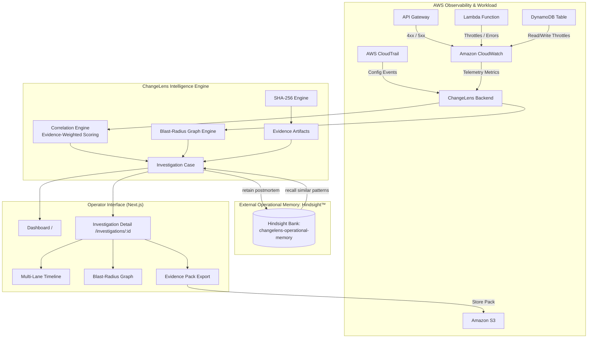

# ChangeLens — AWS Change Impact & Operational Memory

[](https://buildercenter.aws)
[](#)
[](#)
[](https://github.com/vectorize-io/hindsight)
[](backend/tests)
[](LICENSE)

> **An evidence-driven operational intelligence layer above AWS observability connecting infrastructure changes, telemetry anomalies, dependency blast radius, and historical operational memories into an explainable causal graph.**

---

## The Problem

AWS already provides industry-leading observability:
- **AWS CloudTrail** records every API call and configuration mutation.
- **Amazon CloudWatch** tracks billion-scale metrics, alarms, and logs.
- **Application Signals & CloudWatch Investigations** provide deep APM and traces.
- **AWS Config** inventories resource configurations.

Yet during real-world operational incidents, **engineering context remains fragmented**:
1. CloudTrail shows *what changed*, but not downstream impact.
2. CloudWatch shows *a telemetry spike*, but not the initiating human or agent actor.
3. Service topologies show *dependencies*, but lack corroborating change evidence.
4. Autonomous AI agents are making unapproved changes without operational accountability.
5. Critical lessons from past postmortems remain trapped in wikis or human tribal memory.

When an outage strikes, operators are left asking:
> *"What changed, what did it likely affect, what evidence supports that conclusion, and have we seen this operational pattern before?"*

---

## The ChangeLens Solution

ChangeLens does **not** replace CloudWatch or CloudTrail. Instead, it connects the evidence AWS already produces into an explainable change-impact investigation:

```
AWS Changes ──► Actors ──► Resources ──► Dependencies ──► Telemetry Anomalies ──► Agent Actions ──► Approvals ──► Blast Radius ──► Evidence Artifacts ──► Operational Memory
```

### Key Capabilities

- 🔍 **Attributed Change Ingestion:** Ingests CloudTrail infrastructure modifications and attributes them to humans, automation, or autonomous AI agents.
- ⚡ **Telemetry Deviation Correlation:** Matches changes against immediate CloudWatch metric anomalies and business metric drops.
- 🕸️ **Topological Blast-Radius Graph:** Traces the path from changed resource → dependent service → API operation → business impact.
- 📐 **Explainable Impact Scoring:** Computes transparent evidence-weighted scores ($0.35 \times \text{metric} + 0.25 \times \text{temporal} + 0.20 \times \text{dependency} + 0.10 \times \text{actor} + 0.10 \times \text{memory}$).
- 🧠 **Hindsight Operational Memory:** Recalls similar past incidents from a dedicated memory bank (`changelens-operational-memory`) to inform investigation hypotheses.
- 🛡️ **Strict Epistemic Separation:** Live telemetry evidence is visibly segregated from historical memory—recalled memories are context, never causal proof.
- 📦 **Tamper-Evident Evidence Packs:** Exports auditable incident packages with cryptographic SHA-256 content hashes.

---

## Architectural Differentiator: Hindsight™ Operational Memory

ChangeLens integrates [Hindsight](https://github.com/vectorize-io/hindsight) (`vectorize-io/hindsight`) not as a generic conversational chatbot buffer, but as a specialized **Operational Memory** system.

```
CURRENT LIVE AWS EVIDENCE
  ├── CloudTrail: UpdateFunctionConfiguration (concurrency = 1)
  ├── CloudWatch: Lambda Throttles +340%
  └── Dependency: checkout-function -> checkout-api -> POST /checkout
          │
          ▼
HISTORICAL OPERATIONAL MEMORY (Recalled via Hindsight™)
  ├── Incident 2026-09-21: Lambda reserved concurrency reduction -> checkout 5xx
  └── Outcome: Configuration reverted. Similarity: 81%
          │
          ▼
CURRENT HYPOTHESIS: High-Confidence Evidence-Weighted Correlation
```

> [!IMPORTANT]
> **Confidence-Aware Language:** ChangeLens never claims causal certainty when only correlation evidence exists. It utilizes calibrated phrasing such as *"Likely impact"*, *"Evidence-supported hypothesis"*, and *"High-confidence correlation"*.

---

## Architecture Diagram



---

## Deterministic Demo Scenario

ChangeLens includes a deterministic workload and change injection sequence for reliable, reproducible demonstrations:

1. **Architecture:** API Gateway (`/checkout`) ➔ AWS Lambda (`changelens-checkout-function`) ➔ Amazon DynamoDB (`changelens-orders`).
2. **Normal Baseline:** Workload processes ~140 requests/min with healthy latencies and <1% errors.
3. **Operational Change:** Operator reduces Lambda reserved concurrency from `10` to `1`:
   ```bash
   aws lambda put-function-concurrency \
     --function-name changelens-checkout-function \
     --reserved-concurrent-executions 1
   ```
4. **CloudTrail Recording:** CloudTrail logs `UpdateFunctionConfiguration`.
5. **Traffic & Telemetry Shock:**
   - Lambda throttles surge **+340%** within 9 seconds.
   - Lambda errors surge **+180%** within 15 seconds.
   - Downstream API Gateway `5XXError` increases **+27%** within 24 seconds.
   - Business metric `OrdersCreated` drops **-18%** within 40 seconds.
6. **ChangeLens Detection & Correlation:** ChangeLens correlates the change with the telemetry anomalies and calculates an evidence-weighted impact score of **0.87 (HIGH Confidence)**.
7. **Hindsight Recall:** Hindsight identifies 2 previous incidents with an 81% pattern similarity.
8. **Evidence Pack Generation:** Operator exports an auditable Evidence Pack with SHA-256 content verification.

---

## Tech Stack

| Layer | Technologies |
|---|---|
| **Frontend** | Next.js 14, React 18, TypeScript, Tailwind CSS, Lucide Icons |
| **Backend** | Python 3.13 / FastAPI, Pydantic v2, `boto3`, `httpx`, `pytest` |
| **Memory System** | Hindsight (`hindsight-client` SDK) with local fallback provider |
| **AWS Services** | CloudTrail, CloudWatch, Lambda, API Gateway, DynamoDB, S3, EventBridge |
| **Security & Integrity**| SHA-256 cryptographic hashing, account number redaction, read-only AWS default |

---

## Quick Start (Local Development)

### Prerequisites
- Python 3.11+ (Python 3.13 recommended)
- Node.js 18+ & npm
- Docker & Docker Compose (optional)

### 1. Clone & Configure
```bash
git clone https://github.com/srinivasBJ/changelens.git
cd changelens
cp .env.example .env
```

### 2. Run Backend
```bash
cd backend
python3 -m venv venv
source venv/bin/activate
pip install -r requirements.txt
uvicorn app.main:app --host 0.0.0.0 --port 8000 --reload
```
*Backend runs at `http://localhost:8000` (API docs at `http://localhost:8000/docs`).*

### 3. Run Frontend
```bash
cd ../frontend
npm install
npm run dev
```
*Frontend runs at `http://localhost:3000`.*

### 4. Or Run via Docker Compose
```bash
docker compose up --build
```

---

## Test Suite Execution

All core models, correlation engines, memory providers, and API endpoints are thoroughly tested:

```bash
cd backend
venv/bin/pytest -v
```

```
tests/test_api.py::test_health_endpoint PASSED                           [  5%]
tests/test_api.py::test_stats_endpoint PASSED                            [ 10%]
tests/test_api.py::test_changes_endpoints PASSED                         [ 15%]
tests/test_api.py::test_investigations_endpoints PASSED                  [ 21%]
tests/test_api.py::test_events_and_demo_endpoints PASSED                 [ 26%]
tests/test_correlation.py::test_metric_severity_calculation PASSED       [ 31%]
tests/test_correlation.py::test_temporal_proximity_calculation PASSED    [ 36%]
tests/test_correlation.py::test_dependency_weight_same_resource PASSED   [ 42%]
tests/test_correlation.py::test_dependency_weight_direct_dep PASSED      [ 47%]
tests/test_correlation.py::test_dependency_path_bfs PASSED               [ 52%]
tests/test_correlation.py::test_overall_impact_score PASSED              [ 57%]
tests/test_evidence.py::test_evidence_pack_generation PASSED             [ 63%]
tests/test_evidence.py::test_evidence_pack_hash_determinism PASSED       [ 68%]
tests/test_memory.py::test_fallback_memory_provider PASSED               [ 73%]
tests/test_memory.py::test_memory_sanitization PASSED                    [ 78%]
tests/test_models.py::test_change_model PASSED                           [ 84%]
tests/test_models.py::test_agent_action_model PASSED                     [ 89%]
tests/test_models.py::test_evidence_artifact_hash PASSED                 [ 94%]
tests/test_models.py::test_operational_memory_model PASSED               [100%]
============================== 19 passed in 0.44s ==============================
```

---

## Security & Credential Hygiene

- **Read-Only AWS Default:** The `AWSAdapter` exclusively issues read operations (`LookupEvents`, `GetMetricStatistics`).
- **Zero Committed Credentials:** No AWS secret keys, session tokens, or API secrets are stored in Git.
- **Sanitized Retention:** Account numbers are regex-masked (`XXXXXXXXXXXX`) before saving to Hindsight.
- **Hindsight Memory Defense:** Built-in secret/PII scanning is enabled for the `changelens-operational-memory` bank.

---

## Hackathon Scope & Explicit Non-Goals (MVP)

To ensure shipping reliability within AWS promotional credit constraints (~$100):
- **Single Account & Region:** Focuses on one account and `us-east-2`. Multi-account cross-region aggregation is deferred.
- **No Automatic Remediation:** The system provides evidence and recommended actions; destructive automated rollbacks are intentionally omitted for safety.
- **No Heavy ML Training:** Avoids expensive SageMaker endpoints or heavy OpenSearch clusters; uses transparent, explainable scoring.

---

## License

This project is licensed under the MIT License. See [LICENSE](LICENSE) for details.
