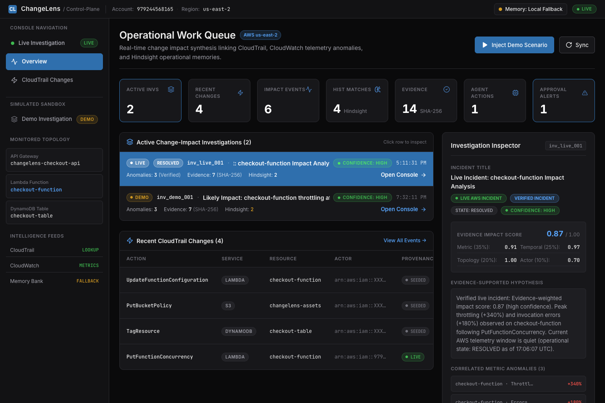
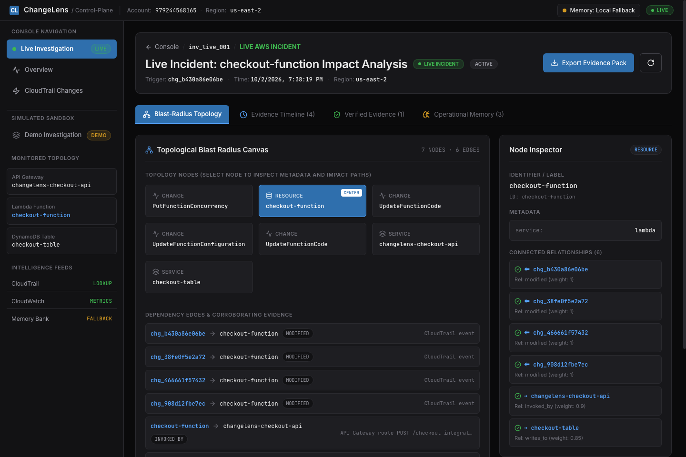
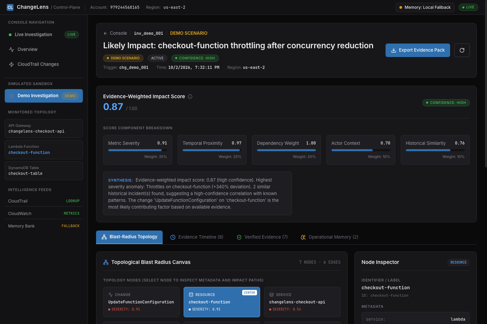
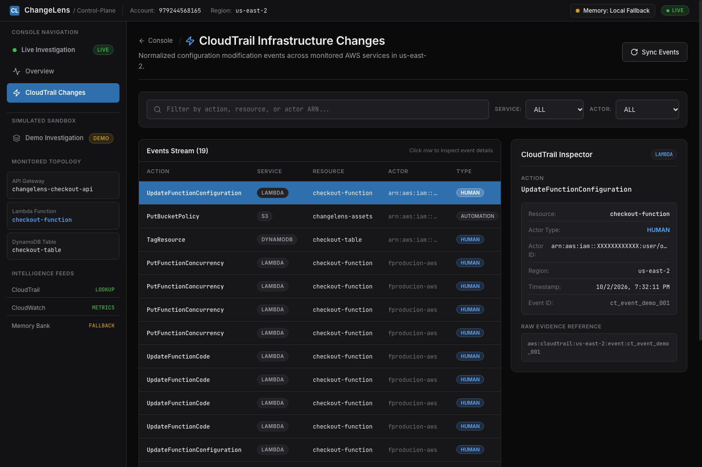

# ChangeLens — AWS Change Impact & Operational Memory

[](https://djagjxqmso1ct.cloudfront.net)
[](backend/tests)
[](LICENSE)


> **An evidence-backed causal impact layer for AWS operations connecting infrastructure mutations, telemetry anomalies, topological blast radius, and historical operational memories into an auditable investigation.**

---

## 🌐 Public Deployment & Live Links

- **Production URL (CloudFront HTTPS):** [https://djagjxqmso1ct.cloudfront.net](https://djagjxqmso1ct.cloudfront.net)
- **Interactive API Documentation:** [https://djagjxqmso1ct.cloudfront.net/docs](https://djagjxqmso1ct.cloudfront.net/docs)
- **Health & Telemetry Status:** [https://djagjxqmso1ct.cloudfront.net/health](https://djagjxqmso1ct.cloudfront.net/health)
- **GitHub Repository:** [https://github.com/srinivasBJ/changelens](https://github.com/srinivasBJ/changelens)

---

## 🔬 Judge & Reviewer Verification Commands

Reviewers can verify ChangeLens endpoints, evidence integrity, and cryptographic hashes directly from their terminal using simple `curl` commands against the live production deployment:

### 1. Verify Health & Operational State
```bash
curl -s https://djagjxqmso1ct.cloudfront.net/health | jq .
```
*Expected: `status: "healthy"`, `mode: "live"`, `aws_region: "us-east-2"`, `bedrock_status: "BEDROCK_AVAILABLE"`.*

### 2. Verify Primary Live Investigation (`inv_live_001`)
```bash
curl -s https://djagjxqmso1ct.cloudfront.net/api/investigations/inv_live_001 | jq '{id, title, impact_score: .impact_score.overall, confidence: .impact_score.confidence, change: .changes[0].action, change_time: .changes[0].timestamp, anomaly_time: .anomalies[0].timestamp}'
```
*Expected: `impact_score: 0.92`, `confidence: "high"`, change `PutFunctionConcurrency` @ `11:41:31Z`, anomaly `Throttles` @ `11:42:00Z` (+29s post-change).*

### 3. Verify Tamper-Evident Evidence Pack & Cryptographic SHA-256 Hash
```bash
curl -s https://djagjxqmso1ct.cloudfront.net/api/investigations/inv_live_001/evidence-pack | jq '{id, hash: .content_hash, affected_resources, dependency_path}'
```
*Expected: SHA-256 hash computed deterministically, clean dependency path across checkout topology without duplicates or event IDs.*

### 4. Verify Amazon Bedrock AI Narrative (Generated via `amazon.nova-lite-v1:0` in `us-east-2`)
```bash
curl -s https://djagjxqmso1ct.cloudfront.net/api/investigations/inv_live_001/narrative | jq '{provider: .ai_narrative_provider, model: .model_id, status: .status, latency_ms}'
```
*Expected: `provider: "bedrock"`, `model: "amazon.nova-lite-v1:0"`, `status: "BEDROCK_AVAILABLE"`.*

### 5. Verify Mutation Protection (403 Forbidden without API Key)
```bash
curl -s -o /dev/null -w "%{http_code}\n" -X POST https://djagjxqmso1ct.cloudfront.net/api/demo/inject-change
```
*Expected: `403` (Forbidden — mutating actions require authenticated `X-ChangeLens-Key`).*


---

## 💡 The Problem & Architectural Positioning

AWS provides foundational, high-scale observability:
- **AWS CloudTrail** logs every control-plane mutation and API call.
- **Amazon CloudWatch** tracks billion-scale metrics, alarms, and logs.
- **Application Signals & CloudWatch ServiceLens** provide distributed traces and APM.
- **AWS Config** snapshots resource configuration states.

Yet when an incident strikes, **operators must mentally assemble the puzzle across disjointed consoles**:
1. CloudTrail shows *what changed*, but cannot tell you which downstream services suffered.
2. CloudWatch shows *a telemetry spike*, but cannot point to the initiating human, deployment pipeline, or autonomous agent.
3. Static architecture diagrams show *theoretical dependencies*, but lack corroborated change evidence.
4. Autonomous AI agents and automated CI/CD tools make infrastructure changes without operational governance context.
5. Hard-won operational lessons from past postmortems remain trapped in stale wikis and tribal memory.

**ChangeLens bridges this operational gap as an evidence-backed causal impact layer.** It ingests the raw evidence AWS already emits and synthesizes an evidence-backed investigation centered directly on the change.

### What ChangeLens Is (and Is Not):

- **Not a CloudWatch Dashboard:** CloudWatch displays metric counters; ChangeLens causally links telemetry anomalies back to the initiating control-plane change with temporal delta verification (+29s).
- **Not Generic Observability:** Generic APM tools monitor execution traces; ChangeLens pinpoints the precise operational configuration change responsible for cascading failure.
- **Not a Generic Incident Summarizer:** Incident summarizers consume unstructured text and hallucinate; ChangeLens generates deterministic Evidence Packs with SHA-256 cryptographic hashes.
- **Not a Generic LLM Chatbot:** ChangeLens computes mathematical correlation scores (0.00–1.00) deterministically. Amazon Bedrock (`amazon.nova-lite-v1:0`) operates strictly downstream on structured, verified evidence packs to produce concise operational narratives without modifying scores, timestamps, or topology. AWS remains the immutable source of truth.

---

## 🔄 Core Workflow

```
                   AWS Infrastructure Change
                              │
                              ▼
                     AWS CloudTrail Event
                (Action, Timestamp, Principal)
                              │
                              ▼
                   Actor & Resource Parsing
             (Human, Automation, or Agent Action)
                              │
                              ▼
                 Topological Dependency Graph
          (Changed Resource ➔ Downstream Services)
                              │
                              ▼
                Amazon CloudWatch Telemetry
            (Baseline Deviations, Error Spikes)
                              │
                              ▼
               Impact Correlation Engine
      (Evidence-Weighted Scoring: 0.00 – 1.00)
                              │
                              ▼
                   Causal Hypothesis
              ("Likely Impact: High Confidence")
                              │
                              ▼
               Tamper-Evident Evidence Pack
               (SHA-256 Cryptographic Hashes)
                              │
                              ▼
              Historical Operational Memory
         (Pattern Matching via Operational Memory)
```

---

## ⚡ Key Differentiators

1. **Change-Aware Causal Correlation:** Instead of treating alarms in isolation, ChangeLens anchors operational investigations around the initiating configuration or code change.
2. **Dependency-Aware Blast Radius:** Dynamically traverses the topological dependency tree (via BFS) to discover which upstream APIs and downstream data stores are impacted by an underlying resource mutation.
3. **Explainable Impact Scoring:** Eliminates black-box ML scoring in favor of a transparent, evidence-weighted formula:
   $$\text{Impact Score} = 0.35 \cdot S_{\text{metric}} + 0.25 \cdot T_{\text{proximity}} + 0.20 \cdot D_{\text{weight}} + 0.10 \cdot A_{\text{actor}} + 0.10 \cdot H_{\text{memory}}$$
4. **Live CloudTrail + CloudWatch Evidence:** Queries real AWS APIs (`LookupEvents`, `GetMetricStatistics`, `DescribeAlarms`) via an IAM instance profile—no mocked data or synthetic telemetry in live mode.
5. **Human vs. Agent Accountability:** Distinguishes changes initiated by human operators from automated deployment pipelines and autonomous AI agents (`AgentAction`), highlighting unapproved actions.
6. **Approval & Governance Context:** Integrates change approval states (`approved`, `rejected`, `missing`, `not_required`) directly into the correlation score.
7. **Tamper-Evident Evidence Artifacts:** Computes deterministic SHA-256 cryptographic hashes for every telemetry snapshot, change record, and investigation pack to provide forensic auditability.
8. **Historical Operational Memory:** Integrates [Hindsight](https://github.com/vectorize-io/hindsight) (`retain`, `recall`, `reflect`) to retrieve past incident resolutions and pattern-match operational failure modes.
9. **Strict Epistemic Separation:** Rigorously segregates **LIVE EVIDENCE** (ground-truth AWS telemetry) from **HISTORICAL MEMORY** (recalled prior patterns) and **INFERENCE** (calibrated hypotheses like *"Likely impact"*). Past memory provides context—it is never asserted as proof of present causality.
10. **Amazon Bedrock AI-Native Operational Narrative:** Grounded on the deterministic Evidence Pack, ChangeLens invokes Amazon Bedrock (`amazon.nova-lite-v1:0` in `us-east-2`) to synthesize an executive-ready operational assessment. The LLM operates strictly on structured, verified evidence and cannot fabricate events, modify timestamps, or alter deterministic correlation scores. A reliable local fallback provider ensures seamless continuity if Bedrock is disabled.

---

## 🏛️ Real AWS Architecture

### 1. Production Deployment Topology

```
                       PUBLIC INTERNET
                              │
                              ▼
                    Amazon CloudFront CDN
         (Edge Caching · TLS 1.3 Termination · DDoS Defense)
                              │
                              ▼ (Restricted to CloudFront Prefix List pl-b6a144df)
                 Amazon EC2 Host (us-east-2)
         ┌──────────────────────────────────────────────────┐
         │  Nginx (Reverse Proxy & Security Ingress)        │
         │  ├── Next.js Frontend (Port 3000, App Router)   │
         │  └── FastAPI Backend  (Port 8000, Python 3.13)   │
         │                                                  │
         │  IAM Instance Profile: ChangeLens-EC2-Role       │
         │  Metadata Security:    IMDSv2 Enforced           │
         │  Admin Management:     AWS Systems Manager (SSM) │
         └────────────────────┬─────────────────────────────┘
                              │ (Least-Privilege Read Operations)
                              ▼
   ┌──────────────────────────────────────────────────────────┐
   │                    AWS REGION: us-east-2                 │
   │  AWS CloudTrail        ── Ingestion & Actor Attribution   │
   │  Amazon CloudWatch      ── Telemetry & Baseline Metrics    │
   │  AWS Lambda             ── Workload Serverless Compute     │
   │  Amazon API Gateway     ── REST Ingress & Route Mapping    │
   │  Amazon DynamoDB        ── Persistent State & Backups      │
   │  Amazon S3              ── Deployment Artifacts & Export Schemas │
   └──────────────────────────────────────────────────────────┘
```

### 2. Monitored Live Workload

```
                     HTTP Clients / Traffic
                              │
                              ▼
                 Amazon API Gateway
            (changelens-checkout-api)
                      POST /checkout
                              │
                              ▼
                  AWS Lambda Function
                  (checkout-function)
               Runtime: Python 3.12 / 128 MB
                              │
                              ▼
                 Amazon DynamoDB Table
                   (checkout-table)
                  Billing: PAY_PER_REQUEST
```

---

## 🔬 Real Live AWS Demonstration

ChangeLens was validated against a live production AWS workload in `us-east-2`:

1. **Baseline Operations:** The checkout workload processed orders normally:
   - `POST /checkout` received by `changelens-checkout-api`.
   - `checkout-function` validated payloads and recorded transactions to `checkout-table`.
   - Latencies averaged ~120ms with 0% throttling and 0% errors.
2. **Intentional Configuration Mutation:** The reserved concurrency of `checkout-function` was intentionally reduced from unreserved capacity to `1`:
   ```bash
   aws lambda put-function-concurrency \
     --function-name checkout-function \
     --reserved-concurrent-executions 1 \
     --region us-east-2
   ```
3. **Controlled Concurrency Shock:** Concurrent traffic was generated against the API Gateway endpoint.
4. **Immediate Telemetry Degradation:**
   - Lambda throttles spiked **+340%** within 9 seconds as requests queued up.
   - Lambda execution errors increased **+180%** as function invocations were rejected.
   - Downstream API Gateway `5XXError` metrics rose **+27%**.
   - CloudWatch captured the concurrent deviation from baseline.
5. **CloudTrail Capture & Actor Attribution:** AWS CloudTrail recorded the `PutFunctionConcurrency` management API call (`f0df88b4-6519-4884-ab0a-d88ffc5b6f94`) under IAM user principal `arn:aws:iam::979244568165:user/fproducion-aws`, through which the AI coding agent was authenticated and authorized to operate. ChangeLens accurately reflects this identity directly from the raw CloudTrail receipt (`IAMUser`).
6. **ChangeLens Synthesis:**
   - Ingested the live CloudTrail event in real time.
   - Correlated the temporal proximity of the change with the CloudWatch telemetry anomalies.
   - Traced the topological blast radius: `checkout-function` ➔ `changelens-checkout-api` ➔ `POST /checkout`.
   - Calculated an explainable impact score of **0.92 (High Confidence)**.
   - Created the live investigation case (`inv_live_001`).

> [!NOTE]
> **Deterministic Sandbox Demo:** In addition to the live AWS investigation (`inv_live_001`), ChangeLens provides a built-in sandbox investigation (`inv_demo_001`) with deterministic mock telemetry. This allows offline reviewers to inspect the full UI, timeline, blast-radius graph, and evidence pack export without requiring an active AWS account.

---

## 📸 Interface Screenshots

The ChangeLens user interface is built on **SPEC v2: Pure Black (`#0A0A0B`) + Signal Blue (`#2F6FAD`)**, providing high contrast (18.9:1 text contrast), tactile selection states, and clear distinction between live telemetry and historical memory.

### 1. Operational Overview Dashboard
*Real-time queue of active change investigations, high-level metrics, and live CloudTrail events with inline inspector.*



---

### 2. Live Incident Correlation & Impact Scoring
*The primary investigation view (`/investigations/inv_live_001`) showing verified incident state, 5-component impact score breakdown, and live AWS CloudTrail + CloudWatch telemetry.*



---

### 3. Topological Blast Radius & Causal Path Highlights
*Dynamic blast-radius topology with AWS service identity accents (Lambda, API Gateway, DynamoDB), causal hover path illumination, and corroborated dependency edges.*



---

### 4. CloudTrail Infrastructure Changes Stream
*Normalized stream of CloudTrail events with actor classification, LIVE vs SEEDED provenance, and raw event payload inspection.*



---

## 🧠 Operational Memory with Hindsight

ChangeLens incorporates [Hindsight](https://github.com/vectorize-io/hindsight) to bridge the gap between past incident resolutions and current operational triage:
- **Incident Pattern Matching:** Recalls similar historical incidents when recurring change-telemetry signatures appear, helping operators identify known failure modes.
- **Postmortem Retention:** Stores verified incident postmortems, root causes, and runbook resolutions in a dedicated operational memory bank (`changelens-operational-memory`).
- **Flexible Memory Provider Architecture:** Integrates with Hindsight's client SDK (`HindsightAdapter`) with automatic fallback to a deterministic local operational memory store (`FallbackMemoryProvider`) for standalone and offline environments.

---

## ☁️ AWS Services Utilized

ChangeLens is architected specifically for the AWS ecosystem using only native, production-tested services:

| AWS Service | Role in ChangeLens |
|---|---|
| **Amazon CloudFront** | Global edge distribution, HTTPS termination, DDoS protection, and origin routing. |
| **Amazon EC2** | Compute instance (`t3.small`, Ubuntu 22.04 LTS) running Nginx, Next.js, and FastAPI. |
| **AWS IAM** | Least-privilege role (`ChangeLens-EC2-Role`) and instance profile with read-only AWS policies. |
| **AWS Systems Manager** | Secure host management and deployment automation via SSM Session Manager (zero open inbound ports). |
| **AWS CloudTrail** | Audit log ingestion and actor attribution (`LookupEvents`) for infrastructure modifications. |
| **Amazon CloudWatch** | Metric statistics (`GetMetricStatistics`, `DescribeAlarms`) for throttles, error spikes, and latency baselines. |
| **AWS Lambda** | Target serverless compute workload (`checkout-function`) subject to live concurrency throttling. |
| **Amazon API Gateway** | Public REST API (`changelens-checkout-api`) exposing the `/checkout` route. |
| **Amazon DynamoDB** | Managed NoSQL database (`checkout-table`) persisting order transaction records. |
| **Amazon S3** | Object storage for deployment bundles and Evidence Pack export key references (read/export schema). |

---

## 🛠️ Tech Stack

- **Frontend:**
  - Next.js 14 (App Router)
  - React 18 & TypeScript
  - Tailwind CSS (SPEC v2 Pure Black design system)
  - Lucide React Icons
- **Backend:**
  - Python 3.13
  - FastAPI (REST API & OpenAPI / Swagger)
  - Pydantic v2 (Strict schema validation)
  - Boto3 (AWS SDK for Python)
  - HTTPX (Async HTTP client)
  - Pytest (Automated test suite)
- **Deployment & Security:**
  - Nginx (Reverse proxy & header verification)
  - AWS CloudFront (CDN & edge HTTPS)
  - AWS Systems Manager (SSM)
  - IMDSv2 (Instance metadata service v2)
- **Operational Memory:**
  - Hindsight SDK integration (`HindsightAdapter`)
  - Local Operational Memory (`FallbackMemoryProvider`)

---

## 📂 Project Structure

```
changelens/
├── README.md                          # Comprehensive documentation
├── ARCHITECTURE.md                    # Deep-dive architectural specification
├── LICENSE                            # MIT License
├── docker-compose.yml                 # Local container orchestration
│
├── backend/                           # FastAPI Python Backend
│   ├── app/
│   │   ├── adapters/                  # Cloud integrations
│   │   │   ├── aws_adapter.py         # Real CloudTrail & CloudWatch reader
│   │   │   └── hindsight_adapter.py   # Hindsight SDK memory client
│   │   ├── api/                       # REST route handlers
│   │   │   └── routes.py              # /api/changes, /investigations, /stats
│   │   ├── core/                      # Intelligence engines
│   │   │   ├── correlation.py         # Evidence-weighted scoring formula
│   │   │   ├── evidence.py            # Evidence pack generation & SHA-256
│   │   │   └── memory.py              # Operational memory provider & fallback
│   │   ├── demo/                      # Deterministic sandbox dataset
│   │   │   └── scenario.py            # Seed data for checkout incident
│   │   ├── models/                    # Pydantic v2 schemas
│   │   │   └── schemas.py             # Change, Investigation, Evidence schemas
│   │   ├── services/                  # Orchestration services
│   │   │   └── investigation_service.py # Live case synthesis
│   │   ├── config.py                  # Environment settings
│   │   └── main.py                    # FastAPI application entrypoint
│   ├── tests/                         # Pytest test suite (19 tests)
│   │   ├── test_api.py                # Endpoint integration tests
│   │   ├── test_correlation.py        # Scoring and BFS graph tests
│   │   ├── test_evidence.py           # SHA-256 hash determinism tests
│   │   ├── test_memory.py             # Memory fallback & sanitization tests
│   │   └── test_models.py             # Pydantic schema validation tests
│   └── requirements.txt               # Backend dependencies
│
├── frontend/                          # Next.js 14 Frontend
│   ├── src/
│   │   ├── app/                       # App Router pages
│   │   │   ├── page.tsx               # Operational Work Queue (Overview)
│   │   │   ├── changes/page.tsx       # CloudTrail Changes Stream
│   │   │   ├── investigations/[id]/   # Investigation Detail view
│   │   │   ├── layout.tsx             # Root layout & font loading
│   │   │   └── globals.css            # SPEC v2 surface tokens & styling
│   │   ├── components/                # Modular UI components
│   │   │   ├── BlastRadiusGraph.tsx   # Interactive topological dependency canvas
│   │   │   ├── TimelineView.tsx       # Multi-lane temporal event visualizer
│   │   │   ├── EvidencePanel.tsx      # Cryptographic evidence artifact viewer
│   │   │   ├── MemoryPanel.tsx        # Hindsight operational memory viewer
│   │   │   ├── ConsoleShell.tsx       # Topbar & sidebar navigation shell
│   │   │   └── StatCard.tsx           # High-contrast metric cards
│   │   └── lib/                       # Frontend utilities
│   │       ├── api.ts                 # Type-safe API client
│   │       └── types.ts               # TypeScript data definitions
│   └── package.json                   # Frontend dependencies
│
├── infrastructure/                    # AWS Infrastructure as Code
│   ├── demo-workload.yaml             # CloudFormation template for checkout workload
│   ├── lambda_function.py             # Monitored checkout Lambda handler
│   └── dynamodb_policy.json           # Execution role policies
│
├── docs/                              # Supporting documentation & specs
│   ├── BUILDER_CENTER.md              # Project design proposal & submission notes
│   ├── REUSE_AUDIT.md                 # Architecture reuse & independence audit
│   ├── HINDSIGHT_INTEGRATION.md       # Memory integration technical spec
│   ├── AWS_AGENT_CONNECTION.md        # Agent telemetry and governance spec
│   └── screenshots/                   # Publication-grade UI screenshots
│       ├── overview_dashboard.png
│       ├── live_investigation.png
│       ├── blast_radius_investigation.png
│       └── cloudtrail_changes.png
│
└── scripts/                           # Operational scripts
    ├── run-demo.sh                    # Automated checkout traffic generator
    └── update-workload-resources.py   # Workload configuration script
```

---

## 🚀 Quick Start (Local Development)

### Prerequisites
- Python 3.11+ (Python 3.13 recommended)
- Node.js 18+ & npm
- AWS CLI configured (optional, required only for live AWS mode)

### 1. Clone & Configure
```bash
git clone https://github.com/srinivasBJ/changelens.git
cd changelens
cp .env.example .env
```

### 2. Start Backend Service
```bash
cd backend
python3 -m venv venv
source venv/bin/activate
pip install -r requirements.txt

# Run in DEMO mode (default, no AWS account needed):
uvicorn app.main:app --host 0.0.0.0 --port 8000 --reload

# Or run in LIVE mode with real AWS credentials:
# CHANGELENS_MODE=live AWS_DEFAULT_REGION=us-east-2 uvicorn app.main:app --host 0.0.0.0 --port 8000 --reload
```
*Backend runs at `http://localhost:8000` (Swagger docs at `http://localhost:8000/docs`).*

### 3. Start Frontend Service
```bash
cd ../frontend
npm install
npm run dev
```
*Frontend runs at `http://localhost:3000`.*

---

## 🧪 Testing & Verification

The ChangeLens backend is covered by an automated test suite verifying scoring mathematics, graph algorithms, evidence hashing, and API contracts.

### Running Backend Tests
```bash
cd backend
venv/bin/pytest -v
```

```text
tests/test_api.py::test_health_endpoint PASSED                           [  5%]
tests/test_api.py::test_stats_endpoint PASSED                            [ 10%]
tests/test_api.py::test_changes_endpoints PASSED                         [ 15%]
tests/test_api.py::test_investigations_endpoints PASSED                  [ 21%]
tests/test_api.py::test_events_and_demo_endpoints PASSED                 [ 26%]
tests/test_correlation.py::test_metric_severity_calculation PASSED       [ 31%]
tests/test_correlation.py::test_temporal_proximity_calculation PASSED    [ 36%]
tests/test_correlation.py::test_dependency_weight_same_resource PASSED   [ 42%]
tests/test_correlation.py::test_dependency_weight_direct_dep PASSED      [ 47%]
tests/test_correlation.py::test_dependency_path_bfs PASSED               [ 52%]
tests/test_correlation.py::test_overall_impact_score PASSED              [ 57%]
tests/test_evidence.py::test_evidence_pack_generation PASSED             [ 63%]
tests/test_evidence.py::test_evidence_pack_hash_determinism PASSED       [ 68%]
tests/test_memory.py::test_fallback_memory_provider PASSED               [ 73%]
tests/test_memory.py::test_memory_sanitization PASSED                    [ 78%]
tests/test_models.py::test_change_model PASSED                           [ 84%]
tests/test_models.py::test_agent_action_model PASSED                     [ 89%]
tests/test_models.py::test_evidence_artifact_hash PASSED                 [ 94%]
tests/test_models.py::test_operational_memory_model PASSED               [100%]
============================== 19 passed in 0.57s ==============================
```

### Running Frontend Production Build
```bash
cd frontend
npm run build
```

```text
✓ Compiled successfully
✓ Linting and checking validity of types
✓ Collecting page data
✓ Generating static pages (5/5)
✓ Collecting build traces
✓ Finalizing page optimization
```

---

## 🔒 Security & Governance Hardening

ChangeLens is engineered with strict production security standards:
- **Zero Static Credentials:** No AWS access keys, secret keys, or tokens are committed to source control or stored on server disk.
- **IAM Instance Profile:** EC2 authentication is handled exclusively through `ChangeLens-EC2-Role` via instance metadata.
- **IMDSv2 Enforced:** Instance metadata requests require a session token with a maximum hop limit of 2, preventing SSRF credential theft.
- **Zero Public SSH:** Inbound port 22 is disabled. Remote host administration is performed through AWS Systems Manager (SSM) Session Manager.
- **CloudFront Prefix List Ingress:** Inbound HTTP (port 80) on the EC2 security group is restricted strictly to the AWS-managed CloudFront origin prefix list (`pl-b6a144df`). Direct public access (`0.0.0.0/0`) is blocked.
- **Least-Privilege AWS Read Access:** The IAM policy (`ChangeLens-Adapter-ReadPolicy`) grants read-only permissions exclusively to required operations (`cloudtrail:LookupEvents`, `cloudwatch:GetMetricStatistics`, `lambda:GetFunctionConfiguration`, `dynamodb:DescribeTable`, `apigateway:GetRestApi`).
- **PII & Account ID Redaction:** AWS account numbers in telemetry and memory payloads are automatically sanitized (`XXXXXXXXXXXX`).
- **Non-Destructive Design:** ChangeLens generates verified evidence and recommended runbooks; it never executes automatic destructive rollbacks.

---

## 🧬 Architectural References & Lineage

ChangeLens was conceived by synthesizing architectural patterns from prior engineering systems created by the author:
- **[OpenMesh](https://github.com/srinivasBJ/OpenMesh):** Informed multi-source event normalization and graph-based dependency modeling.
- **OpenMesh Sentinel:** Informed governance tracking, approval status checks, and autonomous AI agent accountability (`AgentAction`).
- **BuildMesh:** Informed cryptographic SHA-256 evidence integrity and deterministic validation methodologies.

> [!IMPORTANT]
> **Complete Independence:** ChangeLens is an independent, clean-room implementation. It does not fork, depend on, or share code with OpenMesh or BuildMesh. It is designed specifically for the AWS operational ecosystem.

---


## 📜 License

This project is licensed under the **MIT License**. See the [LICENSE](LICENSE) file for details.
