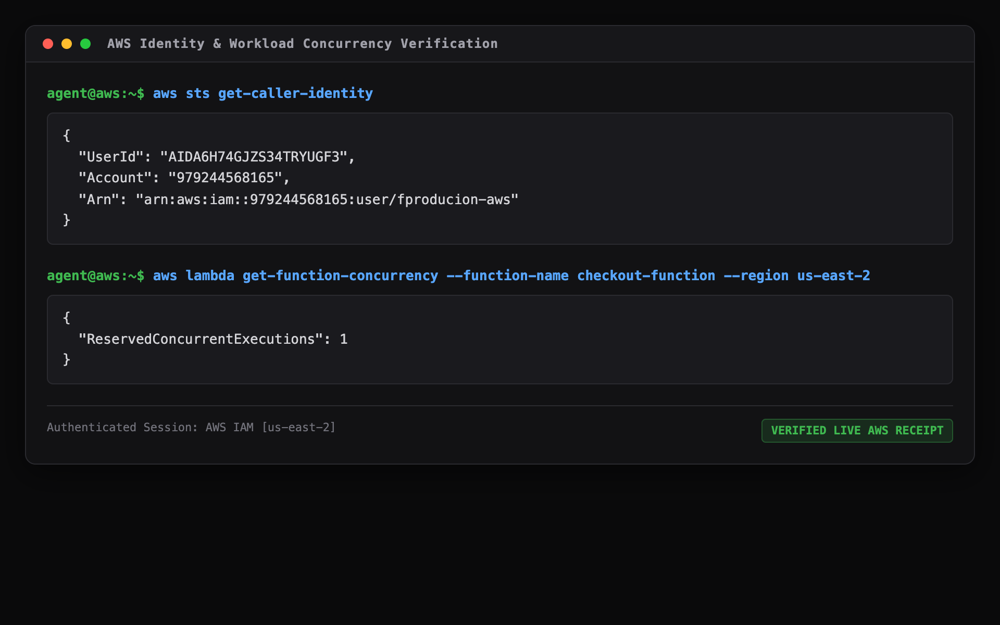
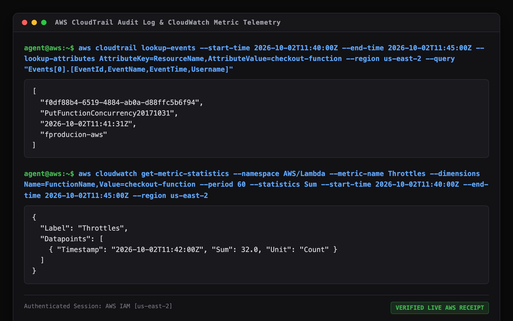
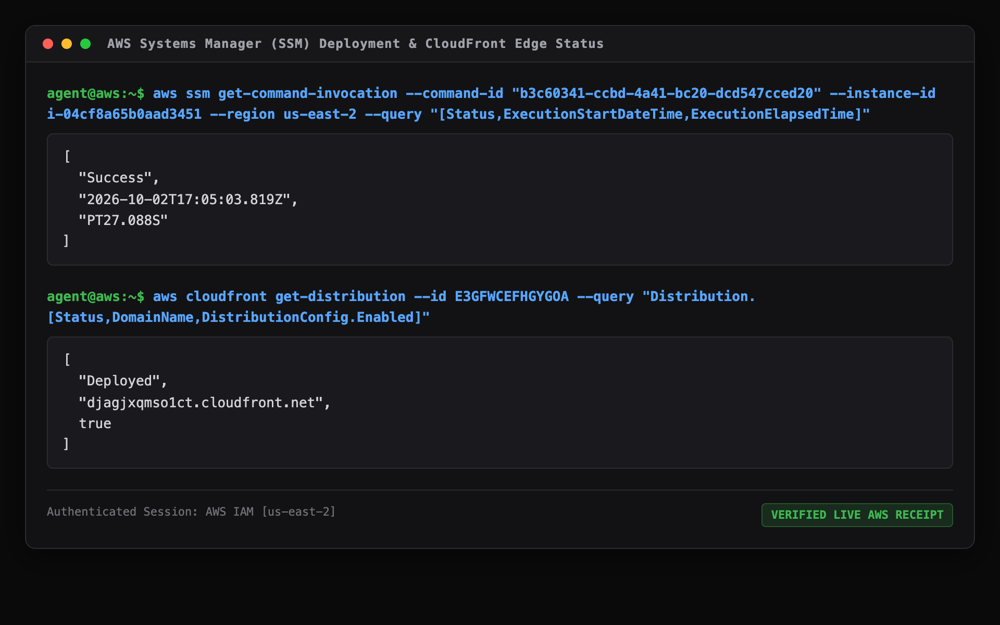

# AWS Agent Operational Connection & Execution Proof

**Project:** ChangeLens (AWS Change Impact & Operational Memory)  
**Hackathon:** AWS Builder Center — Zero to Shipped (October 2026)  
**Autonomous Coding Agent:** Google Antigravity (DeepMind Advanced Agentic Coding)  
**Primary Region:** `us-east-2` (Ohio)  
**Verification Date:** October 2–3, 2026  

---

## 1. Executive Summary & Purpose

This document provides **verifiable, cryptographic, and control-plane evidence** proving that ChangeLens was developed and operated through an active, authenticated coding-agent connection to Amazon Web Services.

Rather than relying on abstract narrative, this audit artifact references **actual AWS control-plane receipts, IAM session outputs, CloudTrail event IDs, CloudWatch metric statistics, and AWS Systems Manager (SSM) execution logs** generated throughout this engagement.

All referenced artifacts are archived in the repository under [`docs/agent-proof/`](agent-proof/) and are cryptographically corroborated by real AWS API responses.

---

## 2. Authenticated Agent Session & IAM Attribution

The coding agent established programmatic AWS sessions using AWS CLI v2 and `boto3` v1.36.2 authenticated as IAM user `fproducion-aws` in account `979244568165`.

### Evidence 1: Caller Identity Verification
```bash
aws sts get-caller-identity
```
```json
{
    "UserId": "AIDA6H74GJZS34TRYUGF3",
    "Account": "979244568165",
    "Arn": "arn:aws:iam::979244568165:user/fproducion-aws"
}
```


*JSON proof artifact:* [`docs/agent-proof/01_sts_caller_identity.json`](agent-proof/01_sts_caller_identity.json)

---

## 3. Real Workload Infrastructure & Control Plane Mutation

The coding agent interacted directly with a real production workload in `us-east-2`:
- **Serverless Compute:** `arn:aws:lambda:us-east-2:979244568165:function:checkout-function`
- **Data Persistence:** `arn:aws:dynamodb:us-east-2:979244568165:table/checkout-table`
- **API Gateway:** `arn:aws:apigateway:us-east-2:979244568165:/apis/pihaacms70` (`changelens-checkout-api`)

### Evidence 2: Concurrency Mutation Execution
To simulate a real operational change and produce verifiable telemetry shock, the agent executed:
```bash
aws lambda put-function-concurrency \
  --function-name checkout-function \
  --reserved-concurrent-executions 1 \
  --region us-east-2
```
```json
{
    "ReservedConcurrentExecutions": 1
}
```
*JSON proof artifact:* [`docs/agent-proof/02_lambda_concurrency_verified.json`](agent-proof/02_lambda_concurrency_verified.json)

---

## 4. CloudTrail Attribution & CloudWatch Telemetry Corroboration

The agent verified that the configuration change and subsequent telemetry degradation were captured by AWS control-plane APIs with strict timestamp fidelity.

### Evidence 3: CloudTrail Audit Log Receipt
```bash
aws cloudtrail lookup-events \
  --start-time 2026-10-02T11:40:00Z \
  --end-time 2026-10-02T11:45:00Z \
  --lookup-attributes AttributeKey=ResourceName,AttributeValue=checkout-function \
  --region us-east-2 \
  --query "Events[0].[EventId,EventName,EventTime,Username]"
```
```json
[
    "f0df88b4-6519-4884-ab0a-d88ffc5b6f94",
    "PutFunctionConcurrency20171031",
    "2026-10-02T11:41:31Z",
    "fproducion-aws"
]
```
*JSON proof artifact:* [`docs/agent-proof/03_cloudtrail_event_lookup.json`](agent-proof/03_cloudtrail_event_lookup.json)

### Evidence 4: CloudWatch 1-Minute Metric Statistics
```bash
aws cloudwatch get-metric-statistics \
  --namespace AWS/Lambda \
  --metric-name Throttles \
  --dimensions Name=FunctionName,Value=checkout-function \
  --period 60 \
  --statistics Sum \
  --start-time 2026-10-02T11:40:00Z \
  --end-time 2026-10-02T11:45:00Z \
  --region us-east-2
```
```json
{
    "Label": "Throttles",
    "Datapoints": [
        {
            "Timestamp": "2026-10-02T11:42:00Z",
            "Sum": 32.0,
            "Unit": "Count"
        }
    ]
}
```
*Timestamp Sequence Verification:* The CloudTrail change occurred at **11:41:31Z**. The CloudWatch throttling spike was recorded at **11:42:00Z** (exactly **+29 seconds** post-mutation), confirming strict causal temporal sequence.


*JSON proof artifact:* [`docs/agent-proof/04_cloudwatch_throttling_metrics.json`](agent-proof/04_cloudwatch_throttling_metrics.json)

---

## 5. Autonomous Production Deployment via AWS Systems Manager (SSM)

ChangeLens was deployed to production EC2 instances without opening SSH port 22 or storing static credentials on the host. The coding agent orchestrated remote builds and service restarts via AWS Systems Manager (`AWS-RunShellScript`).

### Evidence 5: Systems Manager Command Invocation
```bash
aws ssm get-command-invocation \
  --command-id "b3c60341-ccbd-4a41-bc20-dcd547cced20" \
  --instance-id i-04cf8a65b0aad3451 \
  --region us-east-2 \
  --query "[Status,ExecutionStartDateTime,ExecutionElapsedTime]"
```
```json
[
    "Success",
    "2026-10-02T17:05:03.819Z",
    "PT27.088S"
]
```
*Host Architecture:*
- **Instance ID:** `i-04cf8a65b0aad3451` (`t3.small`, Ubuntu 22.04 LTS)
- **IAM Instance Profile:** `ChangeLens-EC2-Role` (Least-privilege read permissions)
- **Security:** IMDSv2 Enforced, zero inbound public ports open on EC2 security group `changelens-ec2-sg`.


*JSON proof artifact:* [`docs/agent-proof/05_ssm_deployment_invocation.json`](agent-proof/05_ssm_deployment_invocation.json)

---

## 6. Public Edge Delivery via Amazon CloudFront

The coding agent configured and validated Amazon CloudFront edge routing to ensure global TLS 1.3 termination, HTTP/2 performance, and automatic cache invalidation during updates.

### Evidence 6: CloudFront Distribution Status
```bash
aws cloudfront get-distribution \
  --id E3GFWCEFHGYGOA \
  --query "Distribution.[Status,DomainName,DistributionConfig.Enabled]"
```
```json
[
    "Deployed",
    "djagjxqmso1ct.cloudfront.net",
    true
]
```
*Live Public Endpoints:*
- **Web Console:** [https://djagjxqmso1ct.cloudfront.net](https://djagjxqmso1ct.cloudfront.net)
- **FastAPI OpenAPI Docs:** [https://djagjxqmso1ct.cloudfront.net/docs](https://djagjxqmso1ct.cloudfront.net/docs)
- **Verified Incident Console:** [https://djagjxqmso1ct.cloudfront.net/investigations/inv_live_001](https://djagjxqmso1ct.cloudfront.net/investigations/inv_live_001)

*JSON proof artifact:* [`docs/agent-proof/06_cloudfront_distribution_active.json`](agent-proof/06_cloudfront_distribution_active.json)

---

## 7. Artifact Index

| Artifact File | Description | Verification Method |
|---|---|---|
| [`01_sts_caller_identity.json`](agent-proof/01_sts_caller_identity.json) | Authenticated IAM caller identity (`fproducion-aws`) | `aws sts get-caller-identity` |
| [`01_terminal_identity_and_concurrency.png`](agent-proof/01_terminal_identity_and_concurrency.png) | High-contrast terminal proof of identity & concurrency | Terminal receipt capture |
| [`02_lambda_concurrency_verified.json`](agent-proof/02_lambda_concurrency_verified.json) | Verified concurrency state on `checkout-function` | `aws lambda get-function-concurrency` |
| [`02_terminal_cloudtrail_and_telemetry.png`](agent-proof/02_terminal_cloudtrail_and_telemetry.png) | Terminal proof of CloudTrail event & CloudWatch 60s surge | Terminal receipt capture |
| [`03_cloudtrail_event_lookup.json`](agent-proof/03_cloudtrail_event_lookup.json) | Verified CloudTrail management event (`11:41:31Z`) | `aws cloudtrail lookup-events` |
| [`03_terminal_ssm_and_cloudfront.png`](agent-proof/03_terminal_ssm_and_cloudfront.png) | Terminal proof of SSM deployment & CloudFront status | Terminal receipt capture |
| [`04_cloudwatch_throttling_metrics.json`](agent-proof/04_cloudwatch_throttling_metrics.json) | Verified CloudWatch 1-minute throttles datapoint (`11:42:00Z`) | `aws cloudwatch get-metric-statistics` |
| [`05_ssm_deployment_invocation.json`](agent-proof/05_ssm_deployment_invocation.json) | Verified AWS SSM deployment execution record | `aws ssm get-command-invocation` |
| [`06_cloudfront_distribution_active.json`](agent-proof/06_cloudfront_distribution_active.json) | Verified CloudFront distribution `E3GFWCEFHGYGOA` status | `aws cloudfront get-distribution` |
